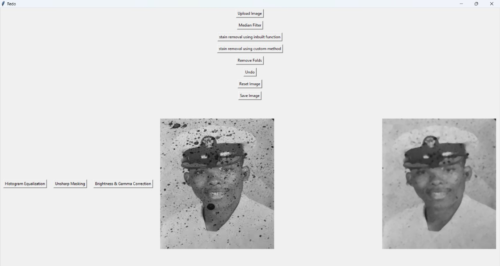

# Restoration-of-Damaged-Images

This our project for the course ECN-316 (Digital Image Processing).Our aim for the project was to find different ways to restore and modify different type of damaged images using techniques we learnt in the course such as grayscale morphological image processing, histogram equalization, unsharp masking, spatial filtering using median and gaussian filter, and also different inpainting techniques.In this project we mainly focused on removing stains, scratches and folds as these are the most commonly ocurring damages we observed in our daily life.
   

## **Starting and Layout**

To run tests, clone the repository and run the command below
```bash
  run main.py
```

Down below is the Ui of the application 



>
    - Click upload to upload the image
The Image to the left side is the original image and to the right side is the processed image which regularly updates after each operations. 

Any action performed can be undone by clicking undo button and you could use resett button to undo all changes.

> 
    - Apply the median filter by clicking the button to remove noise components of images

**Types of Damages and Restoration**
-
**Stains**
:
>These types of damages can be identified as spots of different color, to deal with these type of images we need to take input from the user in the form of bitmasks by painting over the image which can be filled by 2 different functions which are to be chosen by the user depending on their needs.
    - Click on the stain removal function based on your requirement

    - Use mouse to paint over the spots that you determine to remove Stains

    - Press "q" to see the bit mask

    - Press "q" to see the result

**Scratches**
:
>Scratches can be identified as long white lines on our image formed due to mishandling of the image or aging of the image. We are using erosion to fix these kind of damages.
    - Click on the "Remove Scratches" button to perform the operation

**Further Enhancement**
-
**Histogram Equalization**
: 
>Histogram Equalization is used to enhance the contrast in the image autonomously and adaptively. 

**Unsharp Masking**
:
>In Unsharp Masking we first smoothen the image using low pass filters like Gaussian filter and subtract it from the original image to get Unsharp Mask, containing high frequency edges, which can be again added to the image resulting in an edge sharpened image

**Gamma Correction**
: 
>It is a point operation on a pixel with operator  T=Cr^γ+ K . It is used to adjust the brightness of an image. It adds a constant value to each pixel intensity to increase brightness and applies a polynomial function to the pdf of pixel intensity to change the intensity level of image

 
## Authors
- [Gowtham](https://github.com/BlueeMew) - **GUI,Histogram equalization,Gamma correction, Binary Search Fill in stain removal**
- [Tharun_Kumar]() -**Unsharp Masking, BitMasking, Stain removal**
- [S_V_S_Vivek](https://www.github.com/SV-2) - **Scratch removal, grad_fill function in stain removal**


## Resources

[Digital Image Processing FOURTH EDITION Rafael C. Gonzalez • Richard E. Woods. ](https://www.pearsoned.co.in/prc/book/rafael-c-gonzalez-digital-image-processing-4e--4/9789353062989)

[OpenCV Documentation](https://docs.opencv.org/4.x/d2/d96/tutorial_py_table_of_contents_imgproc.html )

[Grayscale Image Processing](https://www.ni.com/docs/en-US/bundle/ni-vision-concepts-help/page/grayscale_morphology.html?srsltid=AfmBOooPGQrH1yjuIVS-w9uHZ6cSFjpU5SZXxxP0DerP9DZI_jAdDqTz)
